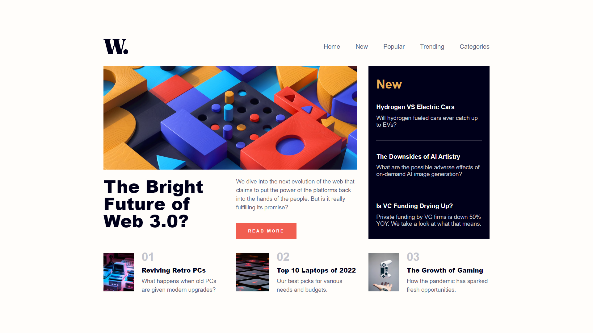
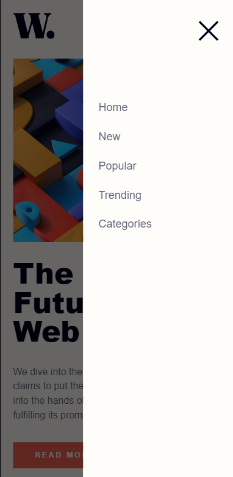

# Product preview card component solution

This is a solution to the [Product preview card component challenge on Frontend Mentor](https://www.frontendmentor.io/challenges/news-homepage-H6SWTa1MFl). 

 

## Table of contents

- [Screenshot](#screenshot)
- [Links](#links)
- [Built with](#built-with)
- [What I learned](#what-i-learned)
- [Author](#author)

 

## Screenshot

 

## Links

- Solution URL: [click here](https://www.frontendmentor.io/solutions/third-solution-ovExMuHF3E)
- Live site URL: [click here](https://linen220.github.io/pagina-noticias/)

 

## Built with

-    
-    
- 

 

## What I learned

* Usage of **grid** & **flex** layout's properties in css.
* **DOM** manipulation in javascript.

 

# Author

- Frontend Mentor - [@Linen220](https://www.frontendmentor.io/profile/Linen220)
- Github - Linen220

 